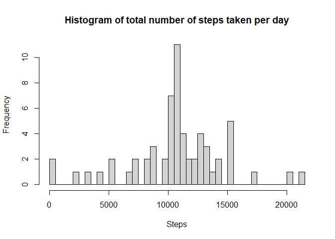

## Loading and preprocessing the data

```r
data<-read.csv('./activity/activity.csv')
data$date<-factor(data$date)
step_date<-tapply(data$steps,data$date,sum)
```
## What is mean total number of steps taken per day?

```r
hist(step_date,breaks=40, 
     main = "Histogram of total number of steps taken per day",
     xlab = "Steps")
```

<!-- -->

```r
step_mean<-format(round(mean(step_date,na.rm=TRUE)),scientific = F)
step_median<-median(step_date,na.rm=TRUE)
```
The mean of total number of steps taken per day is 10766.
The median of total number of steps taken per day is 10765.


## What is the average daily activity pattern?

```r
data_active<-data[!is.na(data$steps),]
data_ac_by_interval<-aggregate(data_active[,c(1,3)],by=list(int = data_active$interval),mean)
with(data_ac_by_interval,
     plot(interval,steps,type="l",
          main ="A time series plot",
          xlab = "the 5-minute interval",
          ylab = "the average number of steps taken"))
```

<!-- -->

```r
int_maximum<-data_ac_by_interval$interval[which.max(data_ac_by_interval$steps)]
```
The 5 minutes interval of 835 contains the maximum number of steps!

## Imputing missing values

```r
mv<-sum(is.na(data$steps))

data_na<-data[is.na(data$steps),]
mdata_na<-merge(data_na,data_ac_by_interval,by.x = 3,by.y = 3,all.y=FALSE)
newdata_na<-mdata_na[c(5,3,4)]
names(newdata_na)<-c("steps","date","interval")
newdata<-rbind(data_active,newdata_na)
newdata_date<-aggregate(newdata$steps,by=list(date_by = newdata$date),sum)
names(newdata_date)<-c("date","steps")

hist(newdata_date$steps,breaks=40, 
     main = "Histogram of total number of steps taken per day",
     xlab = "Steps")
```

<!-- -->

```r
newstep_mean<-format(mean(newdata_date$steps),scientific =FALSE)
newstep_median<-format(median(newdata_date$steps),scientific = FALSE)
```
1. the total number of missing values in the dataset is 2304 !

4.The mean of total number of steps taken per day is 10766.19.
  The median of total number of steps taken per day is 10766.19. 

## Are there differences in activity patterns between weekdays and weekends?

```r
library(lattice)
library(dplyr)
```

```
## 
## Attaching package: 'dplyr'
```

```
## The following objects are masked from 'package:stats':
## 
##     filter, lag
```

```
## The following objects are masked from 'package:base':
## 
##     intersect, setdiff, setequal, union
```

```r
newdata$weekdays<-weekdays(as.Date(newdata$date))
newdata_weekend<-mutate(newdata,weekend = if_else(weekdays =="Sunday"|weekdays =="Saturday",
                   "Weekend","Weekday"))
nd_wd_int<-aggregate(newdata_weekend[,1],
                     by=list(newdata_weekend$interval,newdata_weekend$weekend),
                     mean)
names(nd_wd_int)=c("interval","weekend","steps")
xyplot(steps~interval|weekend, nd_wd_int,type="l",layout=c(1,2),
       xlab = "the 5-minute interval",
       ylab = "the average number of steps taken")
```

<!-- -->

